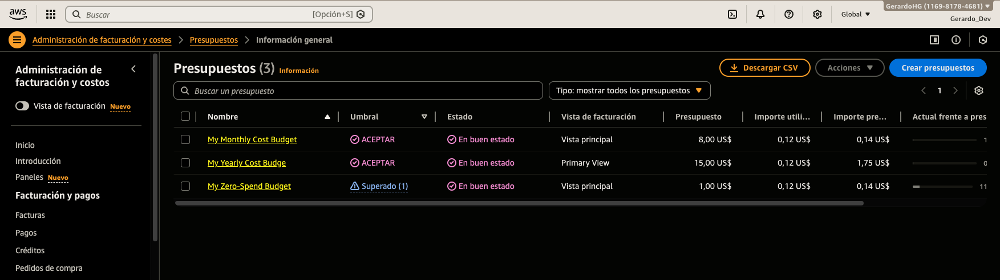

# Configurar Presupuestos de Costes en AWS con AWS Budgets

En este ejercicio práctico, configuraremos tres presupuestos de costes en **AWS** utilizando **AWS Budgets**. 
Estos presupuestos te ayudarán a monitorizar tus gastos estimados y te notificarán por correo electrónico cuando superes
los umbrales definidos.

## Prerrequisitos

- Una cuenta de AWS activa
- Permisos IAM necesarios para acceder a la consola de AWS Budges y SNS
- Tener habilitadas las métricas de facturación (Billing Metric) en la consola de AWS.

## Servicios Clave

- **AWS Budgets**: Servicio que permite establecer presupuestos personalizados y realizar un seguimiento de los costes y el uso.
- **Amazon SNS**: Servicio de mensajería para notificaciones *pub/sub*

### 1. Navegar a AWS Budgets

1. Inicia sesión en la Consola de AWS
2. Asegurarse de estar en la región 'us-east-1' - N. Virginia.
3. Buscar y seleccionar AWS Budgets

### 3. Crear los Presupuestos de Costes

Vamos a crear los tres presupuestos solicitados: `My Monthly Cost Budget`, `My Yearly Cost Budget` y `My Zero-Spend Budget`.

1. Regresa a la consola de **AWS Budgets**.
2. Haz clic en **Crear presupuesto**.
3. Selecciona **Cost budget** y luego **Siguiente**.
4. Elige el método **Simplified** (Simplificado) y haz clic en **Siguiente**.

#### 3.1. Presupuesto 1: My Monthly Cost Budget

Este presupuesto monitorará los gastos mensuales.

1. **Details**:
    - **Name**: `My Monthly Cost Budget`
    - **Period**: **Monthly** (Mensual)
    - **Budget effective date**: Recurring budget (Presupuesto recurrente)
    - **Budget amount**: Introduce un valor (ej. `50` USD)
    - **Advanced options**: Deja los valores predeterminados.
    - Haz clic en **Siguiente**.

2. **Alerts**:
    - **Configurar alertas**:
        - **Umbral (Threshold)**: `80` % de tu cantidad presupuestada.
        - **Trigger**: Actual (Real) o Forecasted (Previsto). Se recomienda Forecasted para advertencias tempranas.
        - **Notification preferences**:
            - Selecciona **Specify an Amazon SNS topic** y elige tu tema de SNS (ej. `TopicosDePresupuesto`).
            - Opcional: añade direcciones de correo electrónico directamente.
    - Haz clic en **Siguiente**.

3. **Actions**:
    - Omite este paso a menos que desees acciones automáticas (ej. detener instancias EC2). Haz clic en **Siguiente**.

4. **Review**:
    - Revisa la configuración y haz clic en **Create budget** (Crear presupuesto).

#### 3.2. Presupuesto 2: My Yearly Cost Budget

Este presupuesto monitorará los gastos anuales. Repite los pasos anteriores.

1. Haz clic en **Crear presupuesto**.
2. **Details**:
    - **Name**: `My Yearly Cost Budget`
    - **Period**: **Yearly** (Anual)
    - **Budget amount**: Introduce un valor (ej. `500` USD)
    - Haz clic en **Siguiente**.

3. **Alerts**:
    - Configura alertas similares al presupuesto mensual. (ej. 90% Forecasted).
    - Haz clic en **Siguiente**.

4. **Actions**:
    - Haz clic en **Siguiente**.

5. **Review**:
    - Revisa y haz clic en **Create budget**.

#### 3.3. Presupuesto 3: My Zero-Spend Budget

Este presupuesto es útil para cuentas que deberían tener cero actividad (ej. una cuenta de prueba inactiva o una cuenta secundaria).

1. Haz clic en **Crear presupuesto**.
2. **Details**:
    - **Name**: `My Zero-Spend Budget`
    - **Period**: **Monthly**
    - **Budget amount**: `0` USD
    - Haz clic en **Siguiente**.

3. **Alerts**:
    - **Umbral**: `0` %.
    - **Trigger**: Actual (Real) o Forecasted.
    - Configura tu notificación de SNS.
    - Haz clic en **Siguiente**.

4. **Actions**:
    - Haz clic en **Siguiente**.

5. **Review**:
    - Revisa y haz clic en **Create budget**.

¡Listo! Ya tienes configurados tus tres presupuestos de gastos en AWS.

## Resultado Esperado

