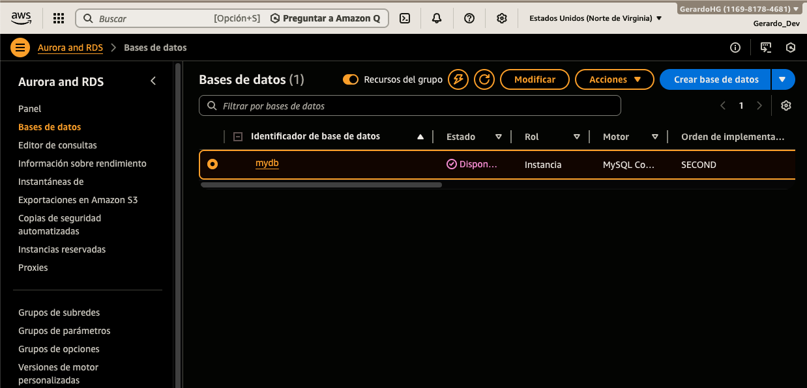
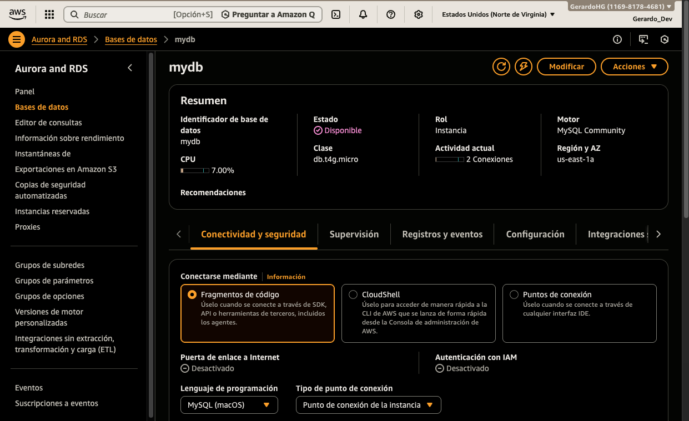
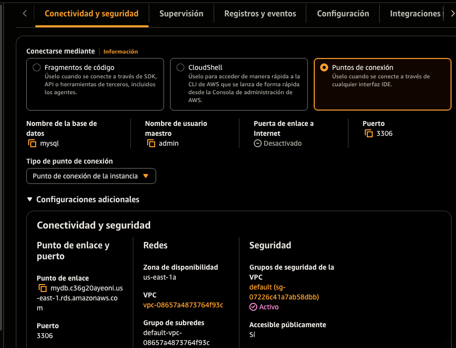
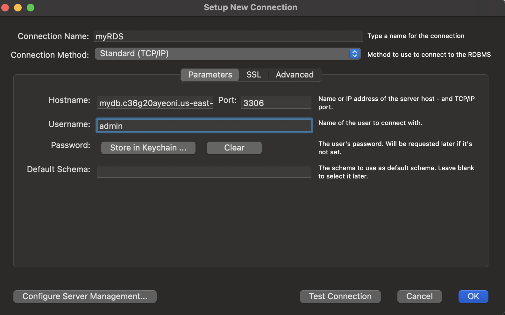

# Crear una instancia de Base de Datos Amazon RDS (MySQL)

En este ejercicio práctico, configuraremos una base de datos relacional en la nube utilizando **Amazon RDS**. Aprenderás a desplegar una instancia de **MySQL** bajo la capa gratuita, configurar sus reglas de acceso mediante grupos de seguridad y realizar una conexión exitosa desde un cliente externo.

## Prerrequisitos

- Una cuenta de AWS activa.
- Conocimientos básicos de **VPC** (Virtual Private Cloud) y **Security Groups**.
- Un cliente SQL instalado (como **MySQL Workbench** o **DBeaver**) para probar la conexión.

## Servicios Clave

- **Amazon RDS (Relational Database Service):** Servicio gestionado que facilita la configuración, el funcionamiento y el escalado de bases de datos relacionales.
- **Amazon VPC:** Entorno de red aislado donde residirá la base de datos.
- **AWS Security Groups:** Actúan como un firewall virtual para controlar el tráfico permitido hacia la instancia.

---

### 1. Navegar a Amazon RDS

1. Inicia sesión en la **Consola de Administración de AWS**.
2. Asegúrate de estar en la región **us-east-1 (N. Virginia)**.
3. En el buscador superior, escribe **RDS** y selecciona el servicio.

### 2. Crear el Grupo de Seguridad (Security Group)

Antes de crear la base de datos, configuraremos el "escudo" que permitirá el tráfico entrante desde tu equipo.

1. Ve a la consola de **EC2** -> **Security Groups**.
2. Haz clic en **Create security group**.
3. Configura los detalles básicos:
   - **Security group name**: `rds-mysql-sg`
   - **Description**: Permitir acceso a MySQL desde mi IP.
4. Agrega una **Regla de Entrada (Inbound Rule)**:
   - **Type**: MySQL/Aurora (Puerto 3306).
   - **Source**: Selecciona **My IP** (Esto garantiza que solo tú puedas acceder).
5. Haz clic en **Create security group**.

---

### 3. Crear la instancia de Base de Datos

Sigue estos pasos para lanzar la instancia de MySQL:

1. En el panel de RDS, haz clic en **Create database**.
2. **Choose a database creation method**: Selecciona **Standard create**.
3. **Engine options**: Selecciona **MySQL**.
4. **Templates**: Selecciona **Free Tier** (Capa gratuita) para evitar costes.

#### 3.1 Configuración de Ajustes (Settings)

1. **DB instance identifier**: `mydb`
2. **Credential Settings**:
   - **Master username**: `admin`
   - **Master password**: Crea una contraseña segura y guárdala bien.

#### 3.2 Configuración de instancia y almacenamiento

1. **DB Instance class**: Deja el valor por defecto (usualmente `db.t3.micro` o `db.t4g.micro`).
2. **Storage**:
   - **Storage type**: General Purpose SSD (gp3).
   - **Allocated storage**: `20` GiB.
   - **Storage autoscaling**: Desactiva la opción **Enable storage autoscaling** para este ejercicio.

#### 3.3 Conectividad y Red

1. **Connectivity**:
   - **VPC**: Selecciona tu VPC predeterminada (Default).
   - **Public access**: Selecciona **Yes** (Fundamental para conectar desde tu cliente local).
   - **VPC security group**: Elige el que creamos anteriormente: **rds-mysql-sg** (asegúrate de quitar el grupo 'default').
   - **Availability Zone**: No preference.

#### 3.4 Configuración Adicional

1. Despliega la sección **Additional configuration**:
   - **Initial database name**: `mydatabase`
   - **Backup**: Desactiva **Enable automated backups** para agilizar el laboratorio.
   - **Encryption**: Asegúrate de que el cifrado esté habilitado.

---

### 4. Revisión y Creación

1. Desplázate al final y verifica que el coste estimado sea de $0 (gracias a la capa gratuita).
2. Haz clic en **Create database**.

> **Nota:** La creación de la base de datos puede tardar entre 5 y 10 minutos. El estado cambiará de **Creating** a **Available**.

---

## Resultado Esperado

Al finalizar, tendrás una instancia de MySQL activa. En la pestaña **Connectivity & security**, copia el **Endpoint** (Punto de enlace), el cual usarás para conectar tu cliente SQL.

### 5. Conexión a MySQL Workbench

1. Abre **MySQL Workbench** en tu ordenador.
2. Crea una nueva conexión e ingresa los valores siguientes:
   - **Connection Name**: `AWS RDS Instance`
   - **Hostname**: Pega aquí el **Punto de enlace (Endpoint)** copiado de la consola.
   - **Port**: `3306`
   - **Username**: `admin`
   - **Password**: Haz clic en **Store in Vault** e ingresa la contraseña configurada en el paso 3.1.

3. Haz clic en **Test Connection**. Si el mensaje es "Successfully made the MySQL connection", ¡has terminado con éxito!
4. Haz clic en **OK** para guardar y entrar a la base de datos.

