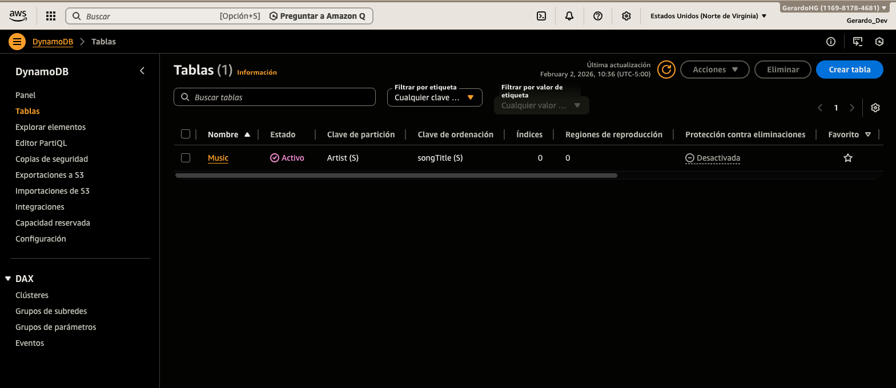
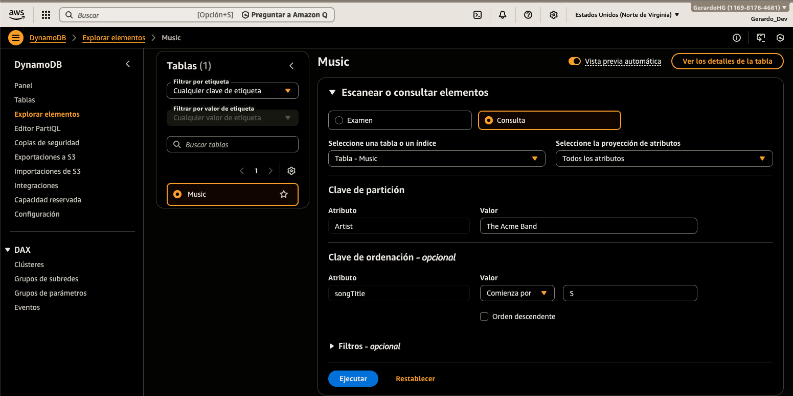
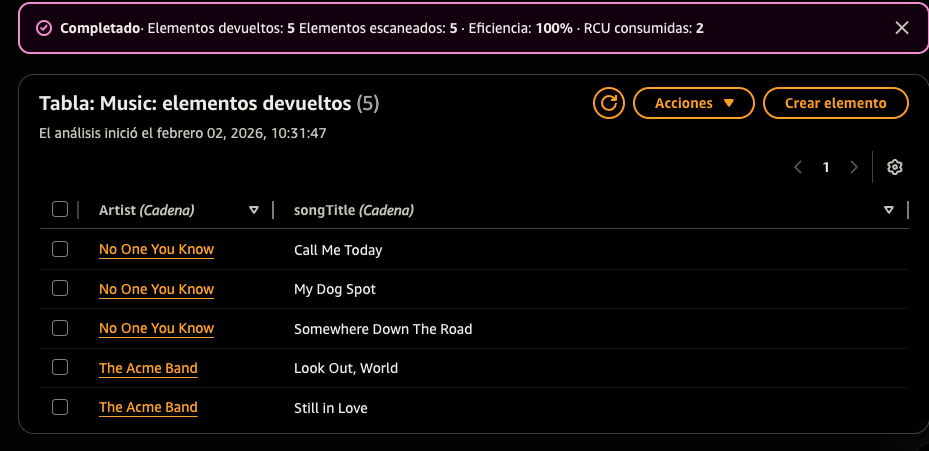

# Crear una Tabla en Amazon DynamoDB

En este ejercicio práctico, configuraremos una base de datos NoSQL utilizando **Amazon DynamoDB**. 
Aprenderás a definir una tabla, configurar sus claves primarias (Partition Key y Sort Key) y realizar operaciones básicas de inserción de datos.

## Prerrequisitos

- Una cuenta de AWS activa.
- Permisos IAM necesarios para acceder a la consola de DynamoDB.
- Entender los conceptos básicos de bases de datos NoSQL (clave-valor y documentos).

## Servicios Clave

- **Amazon DynamoDB:** Servicio de base de datos NoSQL totalmente gestionado que ofrece un rendimiento rápido y predecible con una escalabilidad perfecta.
- **AWS IAM:** (Opcional) Para gestionar el acceso a la tabla mediante políticas de seguridad.

---

### 1. Navegar a Amazon DynamoDB

1. Inicia sesión en la **Consola de Administración de AWS**.
2. En el buscador de servicios, escribe **DynamoDB** y selecciona el servicio.
3. Asegúrate de estar en tu región preferida (ej. `us-east-1`).

### 2. Crear la Tabla

Sigue estos pasos para inicializar tu base de datos NoSQL:

1. En el panel de control de DynamoDB, haz clic en el botón **Create table**.
2. En la sección **Table details**, ingresa los siguientes valores:
   - **Table name**: `Music`
   - **Partition key**: `Artist` (Tipo: String)
   - **Sort key** (Opcional): `songTitle` (Tipo: String)
3. En **Table settings**, selecciona **Default settings** (esto configurará la tabla con capacidad bajo demanda o provista según la capa gratuita).
4. Desplázate al final y haz clic en **Create table**.

> **Nota:** DynamoDB creará la tabla en cuestión de segundos. El estado cambiará de `Creating` a `Active`.

### 3. Gestionar Ítems (Insertar Datos)

A diferencia de las bases de datos SQL, en DynamoDB no necesitas definir todas las columnas (atributos) de antemano.

1. Una vez que la tabla esté **Active**, haz clic en el nombre de la tabla (`Music`).
2. Haz clic en el botón naranja **Explore table items**.
3. Haz clic en **Create item**.
4. En la interfaz de creación:
   - Ingresa el valor para **Artist** (ej. `No One You know`).
   - Ingresa el valor para **SongTitle** (ej. `Call Me Today`).
   - (Opcional) Para añadir más atributos, haz clic en **Add new attribute** -> **String** (ej. `Album`, `Year`).
5. Haz clic en **Create item**.
6. Puede crear items adicionales para el valor de **Artist**

### 4. Consultar y Escanear Datos

1. Dentro de **Explore table items**, verás una sección llamada **Items returned**.
2. Puedes alternar entre:
   - **Scan**: Revisa todos los elementos de la tabla (útil para tablas pequeñas).
   - **Query**: Busca elementos específicos usando la **Partition Key** (más eficiente).
3. Prueba realizando un Filtro para buscar una canción específica de un artista.

## Resultado Esperado

Al finalizar este ejercicio, tendrás una tabla NoSQL funcional con datos insertados. Habrás comprendido la diferencia entre la **Partition Key** (usada para distribuir los datos) y la **Sort Key** (usada para organizar los datos dentro de una partición).

### Siguientes Pasos
- Aprender a utilizar **DynamoDB Streams** para reaccionar a cambios en los datos.
- Configurar **Auto Scaling** para manejar picos de tráfico.
- Implementar un **Global Secondary Index (GSI)** para realizar búsquedas por otros atributos.
